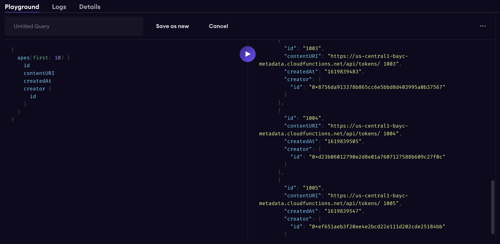

# BAYC Subgraph

This is a test example of a subgraph created in The Graph, it allows to filter the NFT token Ids of the all the users of the BAYC token. It can show an array with the token ids generated by a user and their current owner.

## Deployment Information

- Deployed to: https://thegraph.com/studio/subgraph/bayc
- Development query URL: https://api.studio.thegraph.com/query/32657/bayc/v0.1.4
- Deployment ID: QmQ3N6YmiECTpvAwyqns3haDvcF4BY2gPrDmuqNvRqE8NC

